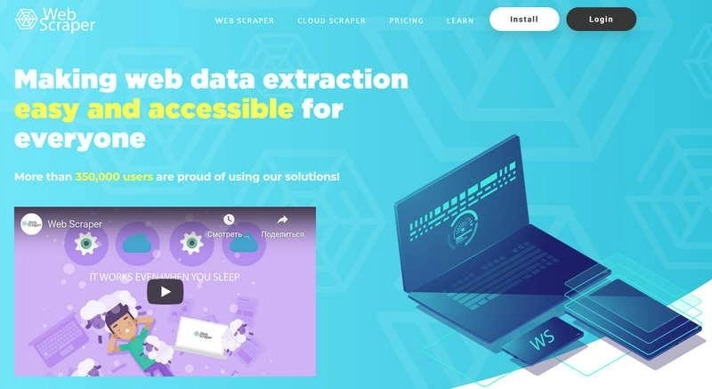

# Choosing the Right Web Scraping Solution: A Complete Guide to Programs, Services, and Frameworks

Web scraping has become an essential tool for businesses and individuals who need to collect large volumes of data efficiently. Whether you're monitoring competitor prices, analyzing market trends, or gathering research data, the right scraping solution can transform how you work with online information. This guide breaks down the landscape of scraping tools—from cloud-based services to desktop programs and custom frameworks—helping you find the perfect match for your specific needs and budget.

---

Web scraping, or automated data collection from websites, has evolved from a niche technical skill into a mainstream business necessity. Forums, news sites, social networks, marketplaces, online stores, and even search engine results—these are just a few sources where organizations routinely harvest content.

The challenge? Manual data collection simply doesn't scale. When you need information from hundreds or thousands of pages, updated regularly, automation becomes the only viable path forward. That's where specialized algorithms come in, extracting structured data according to predefined rules and delivering it in usable formats.

## Who Needs Web Scraping and Why?

Professionals across industries rely on scraping to solve critical business problems, though it's equally valuable for personal projects:

**Marketers** track sales volumes, calculate share of shelf, identify category demand, and forecast sales trends with precision. **Product managers** monitor product metrics, run A/B tests, and measure statistical significance across platforms. **Analysts** keep tabs on competitor pricing strategies in real-time. **Developers** automatically populate online stores with wholesaler content and sync prices dynamically. **SEO specialists** verify metadata completeness (H1, Title, Description), identify broken pages throwing 404 errors, and discover keyword opportunities. **Manufacturing executives** ensure partners aren't undercutting prices and gather essential business intelligence. For **personal use**, you might build a recipe collection, archive educational materials, or preserve any information worth saving.

Understanding these use cases, let's explore what types of scrapers exist and match the right tool to your requirements. We'll categorize scrapers by several key dimensions and examine available market solutions.

## Classification of Web Scraping Programs and Tools

### Resource Usage: Where Does the Work Happen?

This matters significantly if you're scraping regularly for business purposes. You need to decide whether the algorithm runs on the provider's infrastructure or yours. Self-hosting a cloud solution requires dedicated technical staff for installation and maintenance, server space allocation, and computational resources—which gets expensive. However, for truly industrial-scale data collection, this might actually cost less than subscription services (you'll need to compare pricing tiers carefully).

Privacy presents another consideration. Some corporate policies prohibit storing data on external servers. This can often be resolved through API-based data delivery or custom contractual clauses, so examine each service's specific policies.

### Access Method: How You Connect to Scraping Tools

#### Remote Solutions (Cloud-Based Services)

Cloud platforms (SaaS solutions) run on remote servers, sparing your local computer's resources. You connect via browser (enabling work from any operating system) or dedicated application to retrieve your data.

Like all ready-made solutions discussed here, cloud services don't guarantee you can scrape any website. You might encounter complex site structures, technologies the service can't parse, robust anti-scraping protection, or data that's difficult to interpret (like prices displayed as images rather than text).

**Advantages:**
- No local installation required
- Data stored remotely, saving disk space—you only download needed results
- Handle large data volumes effectively
- API integration enables automated data visualization
  
**Disadvantages:**
- Generally more expensive than desktop solutions
- Require configuration and ongoing maintenance
- May struggle with heavily protected sites or complex data interpretation

Let's examine popular services and their operating conditions.

**[Octoparse](https://www.octoparse.com/)** stands out as one of the leading cloud-based scraping services.

**Service Features:**
- Visual interface for data capture
- No programming knowledge required
- Handles dynamic website elements like infinite scroll, login forms, dropdown menus
- English-language interface

**Monthly Pricing:**
- Free plan: collect up to 10,000 data points with 2 parallel threads
- Paid tiers: $89 and $249 with varying data limits
- Custom enterprise plans for specialized requirements

👉 [Discover how cloud-based scraping solutions can transform your data collection workflow](https://www.scraperapi.com/?fp_ref=coupons)

**[Scraper API](https://www.scraperapi.com/)** operates through API calls with comprehensive documentation.

**Service Features:**
- Automatic proxy rotation and failed request retry
- CAPTCHA solving capabilities
- API-based operation requiring coding knowledge
- English-language interface

Example GET request structure:

**Monthly Pricing:**
- Free: 1,000 API calls (up to 5 concurrent requests)
- Starter and mid-tier plans: $29 and $99 without geo-targeting or JavaScript support
- Business plan: includes JavaScript rendering and expanded data collection limits
- Custom enterprise plans available

**[ScrapingHub](https://scrapinghub.com/)** offers a comprehensive cloud toolkit including proxy rotation, headless browser scraping (requiring code), and data storage solutions.

**Service Features:**
- Modular toolkit—select only what you need, but each tool requires separate payment
- API integration available
- Video tutorials for quick onboarding
- English-language interface

**Proxy Pricing (Monthly):**
- Demo access: 10,000 requests
- $99/month: 200,000 requests; $349: 2.5M requests
- Unlimited service starts at $999

**Cloud Storage Pricing (Monthly):**
- Free tier: 7-day data retention, 1-hour scan time limit
- Paid tier: $9

**Browser Access (Monthly):**
- $25/$50/$100 for varying server capabilities

Custom service pricing calculated individually.

**[Mozenda](https://www.mozenda.com/)** supports both cloud and local machine operation with visual point-and-click data capture requiring no programming.

**Service Features:**
- Money-back guarantee if unable to collect your target data
- Strong technical support
- Programming-free scraping setup
- API integration
- Connects with various services, trackers, and BI systems
- English-language interface

**Monthly Pricing:**
- Free 30-day trial
- Paid tiers: $250 to $450 with varying service inclusions
- Custom enterprise plans available

**[ScrapingBee](https://www.scrapingbee.com/)** provides headless browser scraping requiring programming knowledge.

**Service Features:**
- Automatic proxy switching when blocked
- API integration
- JavaScript rendering support
- No charges for failed data retrieval
- English-language interface

**Monthly Pricing:**
- Free tier: 1,000 API calls
- $29: 250,000 requests with proxy support, no API
- $99: 1,000,000 requests with proxy and API
- Custom enterprise plans available

#### Desktop Solutions (Installable Programs)

These programs install directly on your computer, suited for irregular, low-resource tasks. Many offer visual configuration interfaces.

**Advantages:**
- Always accessible, especially on laptops
- Often feature visual programming interfaces

**Disadvantages:**
- Consume local computer resources (processing power, disk space)
- OS-specific—only work on supported operating systems
- No guarantee of successful data extraction or pagination handling
- Typically require separate proxy services to bypass site protections

**[ParseHub](https://www.parsehub.com/)** enables visual, code-free data collection from websites.

Program interface:

**Features:**
- Scheduling capabilities
- Proxy support (bring your own)
- Regular expression support
- API integration
- JavaScript and AJAX compatibility
- Cloud data storage with Google Sheets export
- Cross-platform: Windows, Mac, Linux
- English-language interface

**Monthly Pricing:**
- Free: 200 pages per run, 40-minute limit, text-only data, no proxy rotation
- $149: 10,000 pages per run (200 pages per 10 minutes), file downloads, proxy support, scheduling
- $499: unlimited pages per run (200 pages per 2 minutes), file downloads, proxy support, scheduling
- Custom enterprise tiers

**[Easy Web Extract](http://webextract.net/)** provides straightforward scraping without programming requirements.

Program interface:

**Features:**
- Visual programming
- Up to 24 parallel threads
- Dynamic content scraping
- Human behavior simulation
- Scheduler
- File saving capabilities
- Windows-only
- English-language interface

**Pricing:**
- Free 14-day version: first 200 results collected, 50 results exportable
- Full version: $39; additional licenses $29 each

**[FMiner](http://www.fminer.com/)** offers intuitive visual scraping for sites requiring form submission and proxy support.

Program interface:

**Features:**
- Visual scraper editor
- Dynamic site scraping (Ajax, Javascript)
- Multi-threaded scanning
- CAPTCHA bypass
- Windows and Mac compatible
- English-language interface

**Pricing:**
- Free 15-day trial
- Basic: $168 (lacks Pro features)
- Pro: includes reporting, scheduler, JavaScript configuration

**[Helium Scraper](https://www.heliumscraper.com/eng/)** supports multi-threaded scraping with database capabilities up to 140TB.

Program interface:

**Features:**
- Visual scraper programming
- Dynamic site support (Ajax, Javascript)
- Multi-threaded scanning
- Automatic proxy rotation
- Windows-only
- English-language interface

**Pricing:**
- Free 10-day full-featured trial
- Four tiers: $99 to $699 (differ by license count and update duration)

**[WebHarvy Web Scraper](https://www.webharvy.com/)** automatically detects patterns in website templates, dramatically simplifying scraper configuration.

Program interface:

**Features:**
- Visual point-and-click programming
- Dynamic site scraping (Javascript, Ajax)
- Multi-threaded scanning
- Proxy/VPN support
- Form filling
- Scheduler
- Multi-threading
- URL list scraping
- CAPTCHA handling
- Windows-only
- English-language interface

**Pricing:**
- Free 15-day trial (limited to 2 pages per site)
- Five tiers: $139 to $699 (differ by license count)

### Framework-Based Solutions

When standard solutions don't meet your needs—perhaps you require custom architecture, massive thread management, or unique data processing—building a custom scraper becomes necessary. This demands resources: programmers, servers, specialized tooling, and ongoing maintenance (you'll need to update code whenever source sites change). Let's examine available libraries. We won't evaluate pros and cons here, since choice depends on your existing technology stack and environment—what works perfectly for one team might be suboptimal for another.

#### Python Web Scraping

Python scraping libraries enable fast, efficient programs with API integration. Importantly, these frameworks are open-source.

**[Scrapy](https://scrapy.org/)** ranks as the most popular framework with extensive community support, detailed documentation, and excellent structure.

License: BSD

**[BeautifulSoup](https://www.crummy.com/software/BeautifulSoup/#Download)** parses HTML and XML documents with Russian documentation available. Fast with automatic encoding detection.

License: Creative Commons, Attribution-ShareAlike 2.0 Generic (CC BY-SA 2.0)

**[PySpider](https://github.com/binux/pyspider)** delivers power and speed with JavaScript support but lacks built-in proxy handling.

License: Apache License, Version 2.0

**[Grab](https://grablab.org/docs/)** offers asynchronous operation enabling high-concurrency network threading, with Russian documentation and API operation.

License: MIT License

**[Lxml](https://lxml.de/)** provides simple, fast parsing for large documents, handling XML and HTML with native Python data type conversion. Well-documented and BeautifulSoup-compatible (can serve as its parsing engine).

License: BSD

**[Selenium](https://www.selenium.dev/)** automates browsers with libraries for deployment, browser management, and user action recording/playback. Supports multiple languages: Java, C#, JavaScript, Ruby.

License: Apache License, Version 2.0

#### JavaScript Web Scraping

JavaScript offers ready-made frameworks with convenient APIs for building scrapers.

**[Cheerio](https://cheerio.js.org/)** parses markup quickly, providing data processing functions. Works with HTML using jQuery-style API.

License: MIT License

**[Apify SDK](https://github.com/apify/apify-js)** is a Node.js library handling JSON, JSONL, CSV, XML, XLSX, HTML, and CSS with proxy support.

License: Apache License, Version 2.0

**[Osmosis](https://www.npmjs.com/package/osmosis)** is built on Node.js, finding and loading AJAX content, supporting CSS 3.0 selectors and XPath 1.0, with URL logging and form filling.

License: MIT License

#### Java Web Scraping

Java provides various libraries applicable to web scraping tasks.

**[Jaunt](https://jaunt-api.com/)** offers a lightweight headless browser for scraping and automation, interacting with REST APIs or web applications (JSON, HTML, XHTML, XML). Fills forms, downloads files, handles tabular data, supports Regex.

License: Apache License (software expires monthly, requiring latest version download)

**[Jsoup](https://jsoup.org/)** works with HTML, providing convenient API for URL fetching and data extraction using HTML5 DOM methods and CSS selectors. Proxy-compatible. No XPath support.

License: MIT License

**[HtmlUnit](https://htmlunit.sourceforge.io/)** isn't a unit testing framework—it's a GUI-less browser. Models HTML pages with API for invoking pages, filling forms, clicking links. Supports JavaScript and XPath-based parsing.

License: Apache License, Version 2.0

**[CyberNeko HTML Parser](https://sourceforge.net/projects/nekohtml/)** provides straightforward HTML document parsing with XPath processing.

License: Apache License, Version 2.0

### Browser Extensions

Browser extension scrapers offer ultimate convenience—minimal installation (just a browser), visual data capture without programming.

**[Scrape.it](https://scrape.it/)** is a Chrome extension collecting website data through visual point-and-click interface.

**Features:**
- Visual point-and-click data capture
- Dynamic site scraping (Javascript)
- Multi-threaded scanning
- Proxy server support
- Chrome browser
- English-language interface

**Monthly Pricing:**
- Free 30-day trial
- Three tiers: $19.9, $49.9, $199.9 (differ by concurrent requests and scanning speed)

**[Web Scraper.io](https://webscraper.io/)** functions as a Chrome extension with extensive options and visual programming capabilities.

**Features:**
- Visual website data capture
- Dynamic site scraping (Ajax, Javascript) with scrolling
- Multi-threaded scanning
- Automatic proxy rotation
- Chrome and Firefox compatible
- API integration
- Dropbox result delivery
- English-language interface

**Monthly Pricing:**
- Free 30-day trial
- Three tiers: $19.9, $49.9, $199.9 (differ by concurrent requests and scanning speed)

**[Data Miner](https://data-miner.io/)** works with Google Chrome and Microsoft Edge, collecting data through simple visual interface.

**Features:**
- Code-free website data collection
- Ready templates for 15,000+ popular sites
- URL list scraping
- Pagination with auto-loading
- Automatic form filling
- Chrome and Edge compatible
- Human behavior emulation
- English-language interface

**Monthly Pricing:**
- Free account: 500 pages/month
- Four tiers: $19, $49, $99, $199.9 (500 to 9,000 pages)
- Enterprise: custom negotiated plans

**[Scraper.Ai](https://scraper.ai/)** offers extensive functionality with affordable pricing, supporting Chrome, Firefox, and Edge.

**Features:**
- Code-free website data collection
- Ready templates for Facebook, Instagram, Twitter
- Pagination with auto-loading
- Automatic form filling
- Chrome, Firefox, Edge compatible
- Scheduler
- Website change tracking
- Page limits for quota management
- English-language interface

**Monthly Pricing:**
- Free 3-month trial: 50 pages
- Three tiers: $9, $49, $99 (differ by page limits)

### Task-Specific Solutions

#### Competitor Monitoring

Price monitoring services track competitor pricing for identical products you sell. Compare prices and adjust yours based on market conditions—offering the most competitive price at any moment while maximizing profits when competitors raise theirs.

These services often adapt to specific marketplaces. For independent retailer sites, you'll need to configure data collection yourself or order custom scraping setup.

Monetization: subscription model with pricing tiers based on monitored prices/competitors.

#### Group Buying Organization

These services organize group purchases on social networks, scraping product data and uploading to VKontakte and Odnoklassniki groups. This automates storefront population while monitoring supplier assortment, inventory, and pricing. Typically includes management dashboard, pre-configured integrations, notification systems, and data export—no customization needed.

Monetization: subscription based on number of monitored sites.

#### E-commerce Automation

These services automate product loading (images, descriptions, specifications) from wholesalers while syncing prices and inventory. Fully automates product addition and price management, saving personnel costs. Sources include XML/CSV files or websites that robots harvest.

#### SEO Data Scraping and Analytics

SEO-focused scrapers collect metadata (H1, Title, Description), keywords, build semantic cores, and gather behavioral/quantitative competitor analytics. The toolset is extremely diverse functionally—let's examine popular services for finding your match.

**[SiteAnalyzer](https://site-analyzer.ru/)** checks core technical and SEO data for websites. Key feature: completely free. Runs locally, Windows-only.

**Features:**
- Low system requirements
- Checks pages, images, scripts, documents
- Verifies response codes (200, 404...)
- Checks Title, Description, Canonical headers
- Finds duplicate pages
- Analyzes internal and external links
- Windows-only
- Exports to CSV, Excel, PDF
- Localized in 17 languages including Russian

**Pricing:** Free

**[Screaming Frog SEO Spider](https://www.screamingfrog.co.uk/seo-spider/)** is a powerful, popular SEO audit program. This scraper has established itself as best-in-class with comprehensive SEO analysis functionality.

**Features:**
- Resource-intensive
- Google Analytics and Search Console API support
- User-Agent support
- URL redirect support (local htaccess)
- Scheduler
- Configurable crawl settings
- Checks pages, images, scripts, documents
- Verifies response codes (200, 404...)
- Checks Title, Description, Canonical headers
- Finds duplicate pages
- Analyzes internal and external links
- Windows, MacOS, Ubuntu compatible
- Data export capabilities
- English interface

**Pricing:**
- Free version: limited to 500 URLs with reduced functionality
- Paid full version: £149.99 (approximately $200 or 14,600 rubles)

**[ComparseR](https://parser.alaev.info/)** specializes in analyzing site indexing in Yandex and Google search engines. Discover which pages appear in search results and analyze them accordingly.

**Features:**
- Finds indexed pages
- Regular expression support in configuration
- Automatic CAPTCHA entry
- Checks response codes (200, 404...)
- Checks Title, Description, Canonical headers
- Finds duplicate pages
- Analyzes internal and external links
- Windows-only
- Data export
- Russian-language interface

**Pricing:**
- Free version: first 150 pages or first 150 search results
- Paid full version: 2,000 rubles, unlimited time

### Spreadsheet-Based Scrapers

These scrapers collect data directly into Excel and Google Sheets tables. They rely on macros automating actions or special formulas extracting website data. Suitable for straightforward tasks when target data isn't protected and resides on simple, non-dynamic sites.

**[ParserOk](https://parserok.ru/)** scrapes websites into Microsoft Excel using VBA (macros). This add-in imports website data via pre-created templates, relatively simple to configure. The downside: if templates don't match your needs, customization required.

License costs 2,700 rubles; demo version lasts 10 days.

**Google Sheets functions**—[importhtml](https://support.google.com/docs/answer/3093339?hl=ru) and [importxml](https://support.google.com/docs/answer/3093342?hl=ru)—enable direct data import into spreadsheets. These functions facilitate basic data collection based on pre-programmed inputs. XPath query language knowledge substantially expands formula applications.

## Custom Scraping Solutions

Turnkey services approach tasks individually, writing custom scrapers for specific requirements. These solutions suit unique business challenges—for example, regularly analyzing competitors or collecting particular data types. The advantage: purpose-built solutions extract data even from well-protected sites or require interpretation (like prices displayed as images rather than text). Self-configured programs and services fail in these situations. Plus, such services don't require dedicating staff time to data collection or scraper modifications when source sites change.

For multiple different sites with regular data needs, individually configured scraping proves more cost-effective—easily verified by calculating ready solution costs + programmer costs for writing and maintaining scrapers + server hosting costs.

Examples appear earlier in the cloud scraper section—many offer customizable solutions. Here's a Russian-language service:

**[iDatica](https://idatica.com/)** specializes in organizing scraping, data cleaning, matching, and visualization on demand. iDatica provides Russian-language support, experienced specialists, and has established itself as a reliable partner for developing data collection and visualization solutions. Upon request, the team assigns an analyst to your projects.

👉 [Learn why custom scraping solutions deliver better ROI for complex data projects](https://www.scraperapi.com/?fp_ref=coupons)

**Service Features:**
- Personalized approach to each task
- Turnkey execution—you simply describe requirements
- Works with sites of any complexity
- BI service integration for visualization
- Analyst assignment available
- Russian-language service

**Monthly Pricing:**
- From 2,000 rubles, calculated based on scraping complexity and frequency

## How to Choose the Right Scraper

1. **Define your tasks:** price monitoring, product analytics, machine learning, SEO data, process automation
2. **Identify data sources:** competitor sites, training datasets, your own site, etc.
3. **Determine data volume**—this directly impacts required project resources
4. **Establish collection frequency**

For standard tasks with small data volumes and dedicated personnel, ready-made programs or browser extensions work well.

For scraping complex sites with regular schedules, consider cloud solutions. You'll need dedicated staff managing this project.

When tasks directly impact profitability or project viability, examine cloud services with programming capabilities or scraping libraries, allocate a dedicated programmer, and provision server capacity.

For fast, guaranteed-quality results, choose companies delivering turnkey projects.

---

Web scraping has evolved from technical curiosity to business essential. The right solution depends on your specific requirements—data volume, collection frequency, site complexity, and budget constraints. Whether you choose ready-made tools, cloud platforms, or custom development, the key is matching capability to need. Start by clearly defining your objectives, then explore the options that align with your technical resources and business goals. The investment in proper scraping infrastructure pays dividends in competitive intelligence, operational efficiency, and data-driven decision making.
